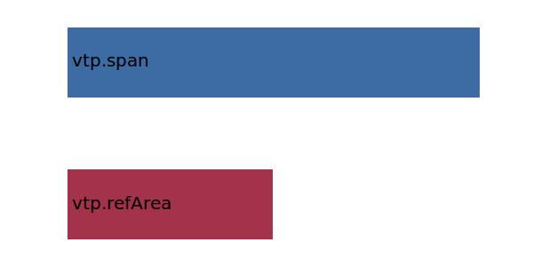

.. _vtp.aspectRatio:

Parameter: aspectRatio
^^^^^^^^^^^^^^^^^^^^^^^^^^^^^^^^^^^^^^^^^^^^^^^^^^^^^^^^

    In aerodynamics, the aspect ratio of a wing is essentially the ratio of its length to its breadth (chord). 
    A high aspect ratio indicates long, narrow wings, whereas a low aspect ratio indicates short, stubby wings.
    For most wings the length of the chord is not a a constant but varies along the wing, so the aspect ratio AR 
    is defined as the square of the wingspan b divided by the area refArea of the wing planform - this is equal to 
    the length-to-breadth ratio for constant breadth.
    
    :Unit: [ ]
    :Wiki: http://en.wikipedia.org/wiki/Aspect_ratio_(wing) 
    

Calculation Methods
"""""""""""""""""""""""""""""""""""""""""""""""""""""""
.. automethod:: VAMPzero.Component.Vtp.Geometry.aspectRatio.aspectRatio.calc

   :Dependencies: 
   * :ref:`vtp.refArea`
   * :ref:`vtp.span`

   :Sensitivities: 

