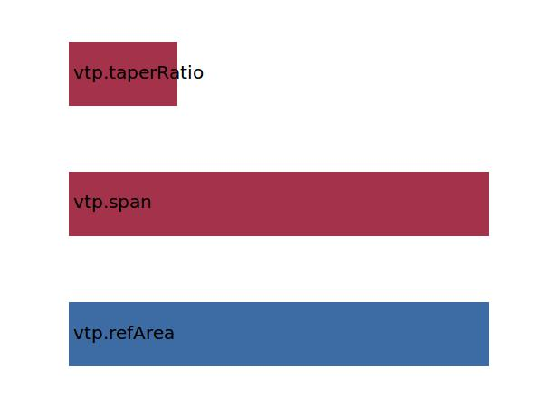

.. _vtp.cRoot:

Parameter: cRoot
^^^^^^^^^^^^^^^^^^^^^^^^^^^^^^^^^^^^^^^^^^^^^^^^^^^^^^^^

    The root chord of the wing
    
    :Unit: [m]
    

Calculation Methods
"""""""""""""""""""""""""""""""""""""""""""""""""""""""
.. automethod:: VAMPzero.Component.Wing.Geometry.cRoot.cRoot.calc

   :Dependencies: 
   * :ref:`vtp.refArea`
   * :ref:`vtp.span`
   * :ref:`vtp.taperRatio`

   :Sensitivities: 

