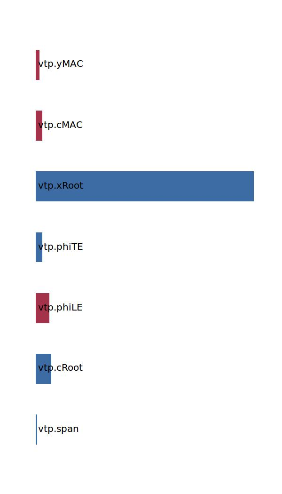

.. _vtp.posCoG:

Parameter: posCoG
^^^^^^^^^^^^^^^^^^^^^^^^^^^^^^^^^^^^^^^^^^^^^^^^^^^^^^^^

    The center of gravity location of the vertical tailplane in x in absolute coordinates
    
    :Unit: [kg] 
    

Calculation Methods
"""""""""""""""""""""""""""""""""""""""""""""""""""""""
.. automethod:: VAMPzero.Component.Vtp.CoG.posCoG.posCoG.calc

   :Dependencies: 
   * :ref:`vtp.span`
   * :ref:`vtp.cRoot`
   * :ref:`vtp.phiLE`
   * :ref:`vtp.phiTE`
   * :ref:`vtp.xRoot`
   * :ref:`vtp.cMAC`
   * :ref:`vtp.yMAC`

   :Sensitivities: 

CPACS Import
"""""""""""""""""""""""""""""""""""""""""""""""""""""""
The values for posCoG are imported from:

.. code-block:: xml

   <cpacs>
      <vehicles>
         <aircraft>
            <model>
               <analyses>
                  <massBreakdown>
                     <mOEM>
                        <mEM>
                           <mStructure>
                              <mWingsStructure>
                                 <mWingStructure[3]>
                                    <massDescription>
                                       <location>
                                          <x>

CPACS Export
-------------------
The values for posCoG are exported to:

.. code-block:: xml

   <cpacs>
      <vehicles>
         <aircraft>
            <model>
               <analyses>
                  <massBreakdown>
                     <mOEM>
                        <mEM>
                           <mStructure>
                              <mWingsStructure>
                                 <mWingStructure[3]>
                                    <massDescription>
                                       <location>
                                          <x>

