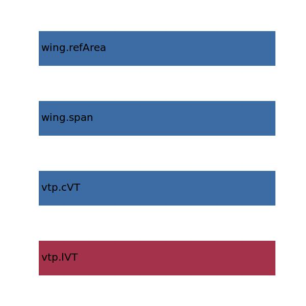

.. _vtp.refArea:

Parameter: refArea
^^^^^^^^^^^^^^^^^^^^^^^^^^^^^^^^^^^^^^^^^^^^^^^^^^^^^^^^

    The reference area for the vertical tail
    
    :Unit: [m2]  
    

Calculation Methods
"""""""""""""""""""""""""""""""""""""""""""""""""""""""
.. automethod:: VAMPzero.Component.Vtp.Geometry.refArea.refArea.calc

   :Dependencies: 
   * :ref:`vtp.lVT`
   * :ref:`vtp.cVT`
   * :ref:`wing.span`
   * :ref:`wing.refArea`

   :Sensitivities: 

CPACS Import
"""""""""""""""""""""""""""""""""""""""""""""""""""""""
.. automethod:: VAMPzero.Component.Vtp.Geometry.refArea.refArea.cpacsImport

