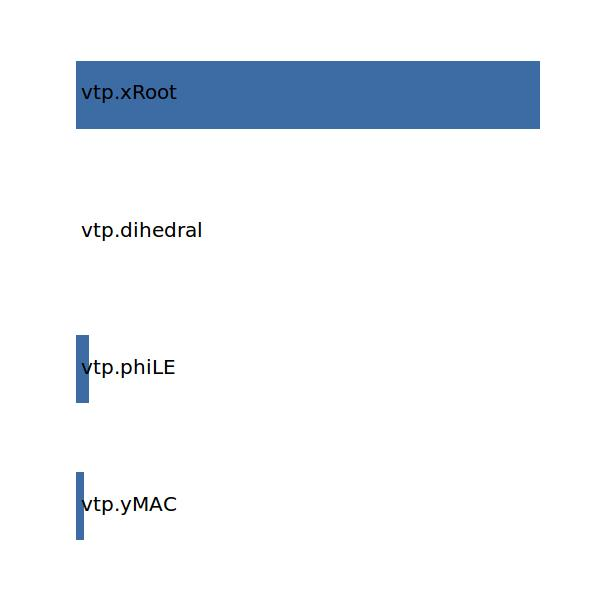

.. _vtp.xMAC:

Parameter: xMAC
^^^^^^^^^^^^^^^^^^^^^^^^^^^^^^^^^^^^^^^^^^^^^^^^^^^^^^^^

    The x location of the mean aerodynamic chord of the vertical tailplane in absolute coordinates
    
    :Unit: [m]
    

Calculation Methods
"""""""""""""""""""""""""""""""""""""""""""""""""""""""
.. automethod:: VAMPzero.Component.Vtp.Geometry.xMAC.xMAC.calc

   :Dependencies: 
   * :ref:`vtp.yMAC`
   * :ref:`vtp.phiLE`
   * :ref:`vtp.dihedral`
   * :ref:`vtp.xRoot`

   :Sensitivities: 

