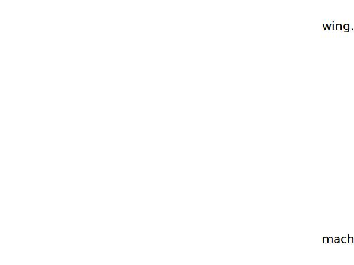

.. _wing.cDw:

Parameter: cDw
^^^^^^^^^^^^^^^^^^^^^^^^^^^^^^^^^^^^^^^^^^^^^^^^^^^^^^^^

    The wave drag is the drag originating from shock waves on the wing due to sonic speeds of the freestream
    
    :Unit: [ ]
    :Wiki: http://en.wikipedia.org/wiki/Wave_drag
    

Calculation Methods
"""""""""""""""""""""""""""""""""""""""""""""""""""""""
.. automethod:: VAMPzero.Component.Wing.Aerodynamic.cDw.cDw.calc

   :Dependencies: 
   * :ref:`aircraft.machCR`
   * :ref:`wing.machCrit`
   * :ref:`wing.machDD`

   :Sensitivities: 

