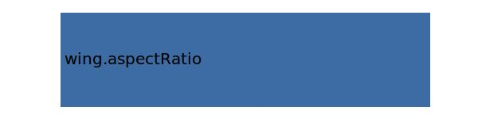

.. _wing.cLalpha:

Parameter: cLalpha
^^^^^^^^^^^^^^^^^^^^^^^^^^^^^^^^^^^^^^^^^^^^^^^^^^^^^^^^

    The rise in cL depending on alpha 
    
    :Unit: [ ]
    

Calculation Methods
"""""""""""""""""""""""""""""""""""""""""""""""""""""""
.. automethod:: VAMPzero.Component.Wing.Aerodynamic.cLalpha.cLalpha.calc

   :Dependencies: 
   * :ref:`wing.aspectRatio`

   :Sensitivities: 

