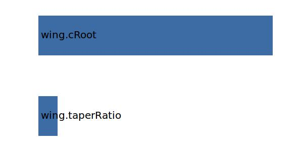

.. _wing.cMAC:

Parameter: cMAC
^^^^^^^^^^^^^^^^^^^^^^^^^^^^^^^^^^^^^^^^^^^^^^^^^^^^^^^^

    Physically, MAC is the chord of a rectangular wing, which has the same area, 
    aerodynamic force and position of the center of pressure at a given angle of attack as 
    the given wing has. Simply stated, MAC is the width of an equivalent rectangular wing in given 
    conditions. Therefore, not only the measure but also the position of MAC is often important. 
    In particular, the position of center of mass (CoM) of an aircraft is usually measured relative to the 
    MAC, as the percentage of the distance from the leading edge of MAC to CoM with respect to MAC itself.    
    
    :Unit: [m]
    :Wiki: http://en.wikipedia.org/wiki/Chord_(aircraft)#Mean_aerodynamic_chord
    

Calculation Methods
"""""""""""""""""""""""""""""""""""""""""""""""""""""""
.. automethod:: VAMPzero.Component.Wing.Geometry.cMAC.cMAC.calc

   :Dependencies: 
   * :ref:`wing.taperRatio`
   * :ref:`wing.cRoot`

   :Sensitivities: 

CPACS Import
"""""""""""""""""""""""""""""""""""""""""""""""""""""""
The values for cMAC are imported from:

.. code-block:: xml

   <cpacs>
      <vehicles>
         <aircraft>
            <model>
               <reference>
                  <length>

CPACS Export
-------------------
The values for cMAC are exported to:

.. code-block:: xml

   <cpacs>
      <vehicles>
         <aircraft>
            <model>
               <reference>
                  <length>

