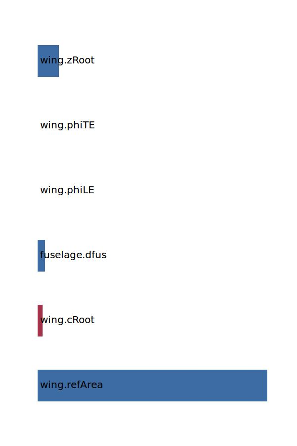

.. _wing.expArea:

Parameter: expArea
^^^^^^^^^^^^^^^^^^^^^^^^^^^^^^^^^^^^^^^^^^^^^^^^^^^^^^^^

    The exposed area of the wing
    
    :Unit: [m2] 
    :Wiki: http://adg.stanford.edu/aa241/wingdesign/winggeometry.html
    

Calculation Methods
"""""""""""""""""""""""""""""""""""""""""""""""""""""""
.. automethod:: VAMPzero.Component.Wing.Geometry.expArea.expArea.calc

   :Dependencies: 
   * :ref:`wing.refArea`
   * :ref:`wing.cRoot`
   * :ref:`fuselage.dfus`
   * :ref:`wing.phiLE`
   * :ref:`wing.phiTE`
   * :ref:`wing.zRoot`

   :Sensitivities: 

