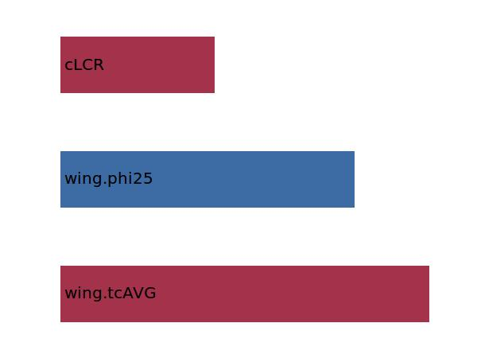

.. _wing.machDD:

Parameter: machDD
^^^^^^^^^^^^^^^^^^^^^^^^^^^^^^^^^^^^^^^^^^^^^^^^^^^^^^^^

    The drag divergence Mach number indicates the speed at which the rise in 
    drag due to supersonic effects becomes significant. Within VAMPzero the 
    definition used by W.H. Mason is used where dCd/dM=0.1
    
    
    :Unit: [ ]
    :Wiki: http://en.wikipedia.org/wiki/Drag_divergence_Mach_number
    

Calculation Methods
"""""""""""""""""""""""""""""""""""""""""""""""""""""""
.. automethod:: VAMPzero.Component.Wing.Aerodynamic.machDD.machDD.calc

   :Dependencies: 
   * :ref:`wing.tcAVG`
   * :ref:`wing.phi25`
   * :ref:`aircraft.cLCR`

   :Sensitivities: 

