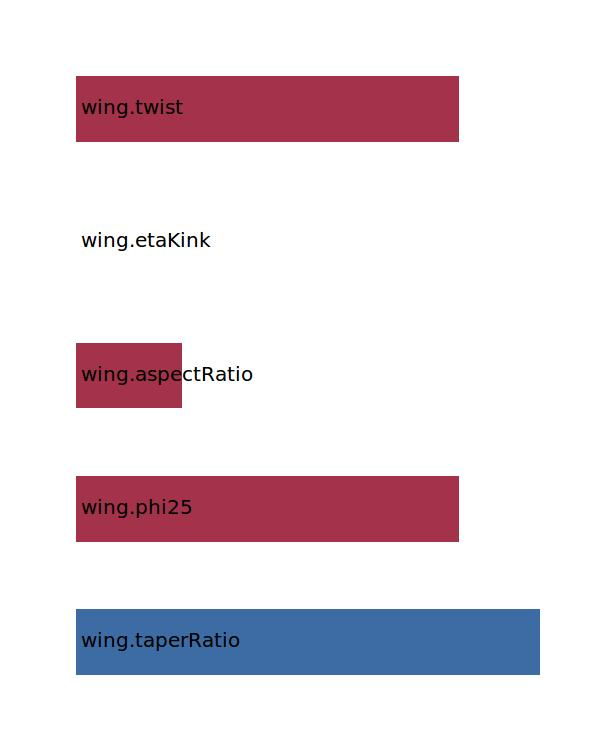

.. _wing.oswald:

Parameter: oswald
^^^^^^^^^^^^^^^^^^^^^^^^^^^^^^^^^^^^^^^^^^^^^^^^^^^^^^^^

    The Oswald efficiency, similar to the span efficiency, is a correction factor that represents
    the change in drag with lift of a three dimensional wing or airplane, as compared with an ideal
    wing having the same aspect ratio and an elliptical lift distribution.
    
    This part of the Oswald factor calculation relates to the calculation of a theoretical lift factor for the
    wing of the aircraft. Further corrections are made for the Oswald factor on aircraft level. 

    :Unit: [ ]

    :Wiki: http://en.wikipedia.org/wiki/Oswald_efficiency_number
    

Calculation Methods
"""""""""""""""""""""""""""""""""""""""""""""""""""""""
.. automethod:: VAMPzero.Component.Wing.Aerodynamic.oswald.oswald.calc

   :Dependencies: 
   * :ref:`wing.taperRatio`
   * :ref:`wing.phi25`
   * :ref:`wing.aspectRatio`
   * :ref:`wing.etaKink`
   * :ref:`wing.twist`

   :Sensitivities: 

.. automethod:: VAMPzero.Component.Wing.Aerodynamic.oswald.oswald.calcLiLi

   :Dependencies: 
   * :ref:`wing.aspectRatio`
   * :ref:`aircraft.machCR`
   * :ref:`wing.reynoldsNr`

.. automethod:: VAMPzero.Component.Wing.Aerodynamic.oswald.oswald.calcRaymer

   :Dependencies: 
   * :ref:`wing.aspectRatio`
   * :ref:`wing.phiLE`

   :Sensitivities: 
.. image:: calcRaymer.jpg 
   :width: 80% 

CPACS Import
"""""""""""""""""""""""""""""""""""""""""""""""""""""""
.. automethod:: VAMPzero.Component.Wing.Aerodynamic.oswald.oswald.cpacsImport

