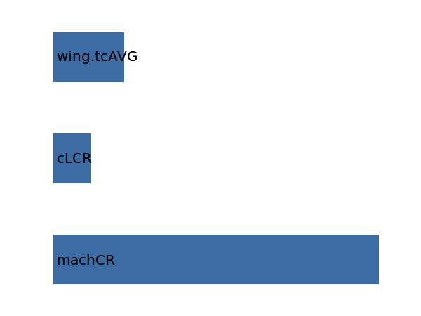

.. _wing.phi25:

Parameter: phi25
^^^^^^^^^^^^^^^^^^^^^^^^^^^^^^^^^^^^^^^^^^^^^^^^^^^^^^^^

    The angle of sweep which characterizes a swept wing is 
    conventionally measured along the 25% chord line. If 
    the 25% chord line varies in sweep angle, the leading edge is used; 
    if that varies, the sweep is expressed in sections (e.g., 25 degrees 
    from 0 to 50% span, 15 degrees from 50% to wingtip).
    
    :Unit: [deg]
    :Wiki: http://en.wikipedia.org/wiki/Swept_wing
    

Calculation Methods
"""""""""""""""""""""""""""""""""""""""""""""""""""""""
.. automethod:: VAMPzero.Component.Wing.Geometry.phi25.phi25.calc

   :Dependencies: 
   * :ref:`aircraft.machCR`
   * :ref:`aircraft.cLCR`
   * :ref:`wing.tcAVG`

   :Sensitivities: 

CPACS Import
"""""""""""""""""""""""""""""""""""""""""""""""""""""""
.. automethod:: VAMPzero.Component.Wing.Geometry.phi25.phi25.cpacsImport

