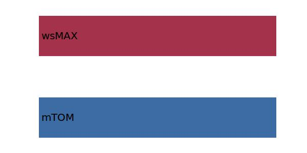
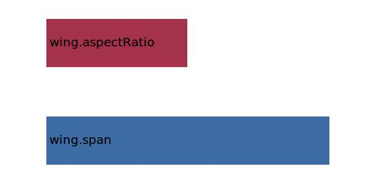

.. _wing.refArea:

Parameter: refArea
^^^^^^^^^^^^^^^^^^^^^^^^^^^^^^^^^^^^^^^^^^^^^^^^^^^^^^^^

    The reference area of the wing 
    
    
    :Unit: [m2]
    :Wiki: http://adg.stanford.edu/aa241/wingdesign/winggeometry.html
    

Calculation Methods
"""""""""""""""""""""""""""""""""""""""""""""""""""""""
.. automethod:: VAMPzero.Component.Wing.Geometry.refArea.refArea.calc

   :Dependencies: 
   * :ref:`aircraft.mTOM`
   * :ref:`aircraft.wsMAX`

   :Sensitivities: 

.. automethod:: VAMPzero.Component.Wing.Geometry.refArea.refArea.calcGeom

   :Dependencies: 
   * :ref:`wing.span`
   * :ref:`wing.aspectRatio`

   :Sensitivities: 

.. automethod:: VAMPzero.Component.Wing.Geometry.refArea.refArea.calcSizing

   :Dependencies: 
   * :ref:`aircraft.mTOM`
   * :ref:`aircraft.wsMAX`

   :Sensitivities: 

CPACS Import
"""""""""""""""""""""""""""""""""""""""""""""""""""""""
The values for refArea are imported from:

.. code-block:: xml

   <cpacs>
      <vehicles>
         <aircraft>
            <model>
               <reference>
                  <area>

CPACS Export
-------------------
The values for refArea are exported to:

.. code-block:: xml

   <cpacs>
      <vehicles>
         <aircraft>
            <model>
               <reference>
                  <area>

