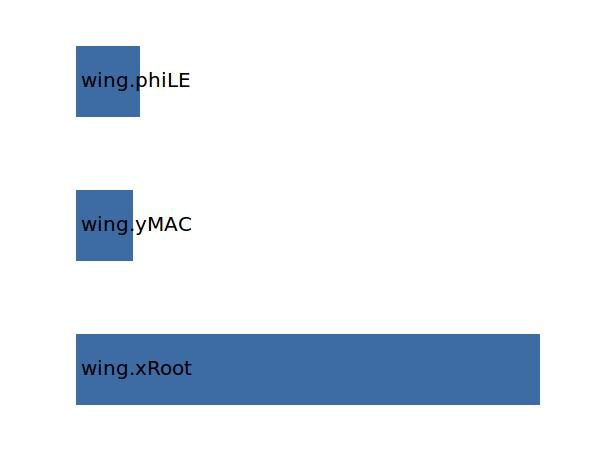
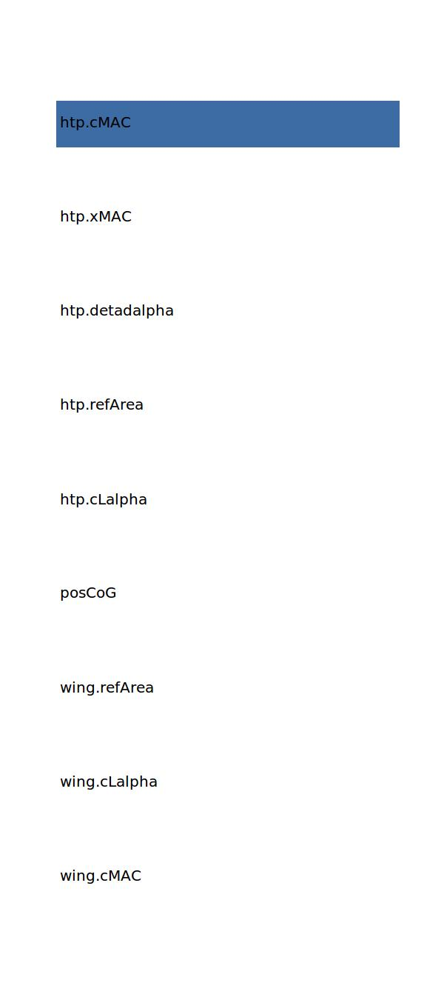

.. _wing.xMAC:

Parameter: xMAC
^^^^^^^^^^^^^^^^^^^^^^^^^^^^^^^^^^^^^^^^^^^^^^^^^^^^^^^^

    The x location of the mean aerodynamic chord of the wing in absolute coordinates
    
    :Unit: [m]
    

Calculation Methods
"""""""""""""""""""""""""""""""""""""""""""""""""""""""
.. automethod:: VAMPzero.Component.Wing.Geometry.xMAC.xMAC.calc

   :Dependencies: 
   * :ref:`wing.xRoot`
   * :ref:`wing.yMAC`
   * :ref:`wing.phiLE`

   :Sensitivities: 

.. automethod:: VAMPzero.Component.Wing.Geometry.xMAC.xMAC.calcGeometry

   :Dependencies: 
   * :ref:`wing.xRoot`
   * :ref:`wing.yMAC`
   * :ref:`wing.phiLE`

   :Sensitivities: 

.. automethod:: VAMPzero.Component.Wing.Geometry.xMAC.xMAC.calcStability

   :Dependencies: 
   * :ref:`wing.cMAC`
   * :ref:`wing.cLalpha`
   * :ref:`wing.refArea`
   * :ref:`aircraft.posCoG`
   * :ref:`htp.cLalpha`
   * :ref:`htp.refArea`
   * :ref:`htp.detadalpha`
   * :ref:`htp.xMAC`
   * :ref:`htp.cMAC`

   :Sensitivities: 

