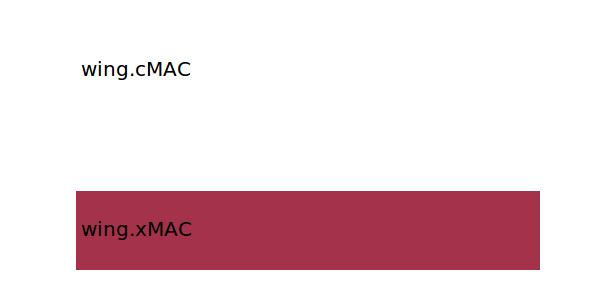

.. _wing.xMAC25:

Parameter: xMAC25
^^^^^^^^^^^^^^^^^^^^^^^^^^^^^^^^^^^^^^^^^^^^^^^^^^^^^^^^

    The x location of 25% of the mean aerodynamic chord of the wing in absolute coordinates
    
    :Unit: [m]
    

Calculation Methods
"""""""""""""""""""""""""""""""""""""""""""""""""""""""
.. automethod:: VAMPzero.Component.Wing.Geometry.xMAC25.xMAC25.calc

   :Dependencies: 
   * :ref:`wing.xMAC`
   * :ref:`wing.cMAC`

   :Sensitivities: 

CPACS Import
"""""""""""""""""""""""""""""""""""""""""""""""""""""""
The values for xMAC25 are imported from:

.. code-block:: xml

   <cpacs>
      <vehicles>
         <aircraft>
            <model>
               <reference>
                  <point>
                     <x>

CPACS Export
-------------------
The values for xMAC25 are exported to:

.. code-block:: xml

   <cpacs>
      <vehicles>
         <aircraft>
            <model>
               <reference>
                  <point>
                     <x>

