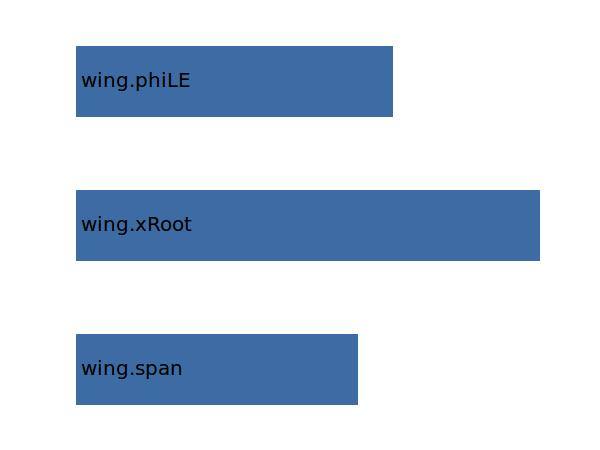

.. _wing.xTip:

Parameter: xTip
^^^^^^^^^^^^^^^^^^^^^^^^^^^^^^^^^^^^^^^^^^^^^^^^^^^^^^^^

    x position of the wings tip section 
    

Calculation Methods
"""""""""""""""""""""""""""""""""""""""""""""""""""""""
.. automethod:: VAMPzero.Component.Wing.CPACS.xTip.xTip.calc

   :Dependencies: 
   * :ref:`wing.span`
   * :ref:`wing.xRoot`
   * :ref:`wing.phiLE`

   :Sensitivities: 

