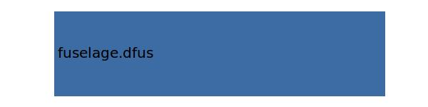

.. _wing.yFuselage:

Parameter: yFuselage
^^^^^^^^^^^^^^^^^^^^^^^^^^^^^^^^^^^^^^^^^^^^^^^^^^^^^^^^

    y Position of the wing station at Fuselage Intersection
    

Calculation Methods
"""""""""""""""""""""""""""""""""""""""""""""""""""""""
.. automethod:: VAMPzero.Component.Wing.CPACS.yFuselage.yFuselage.calc

   :Dependencies: 
   * :ref:`fuselage.dfus`

   :Sensitivities: 

