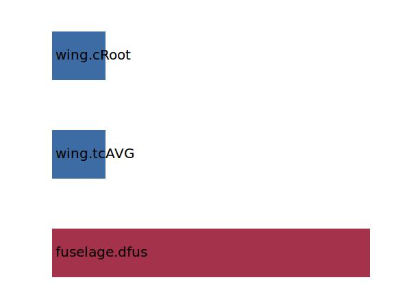

.. _wing.zRoot:

Parameter: zRoot
^^^^^^^^^^^^^^^^^^^^^^^^^^^^^^^^^^^^^^^^^^^^^^^^^^^^^^^^

    The z position at wing root in absolute coordinates
    
    :Unit: [m]
    

Calculation Methods
"""""""""""""""""""""""""""""""""""""""""""""""""""""""
.. automethod:: VAMPzero.Component.Wing.Geometry.zRoot.zRoot.calc

   :Dependencies: 
   * :ref:`fuselage.dfus`
   * :ref:`wing.tcAVG`
   * :ref:`wing.cRoot`

   :Sensitivities: 

CPACS Import
"""""""""""""""""""""""""""""""""""""""""""""""""""""""
.. automethod:: VAMPzero.Component.Wing.Geometry.zRoot.zRoot.cpacsImport

