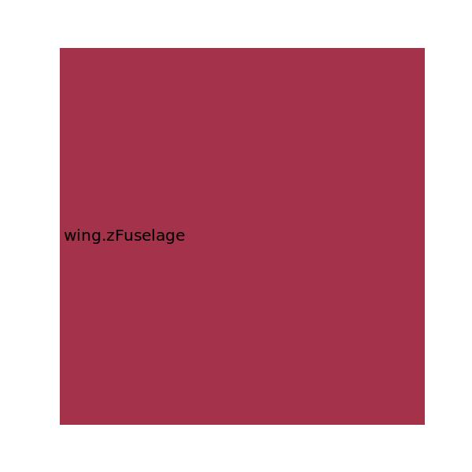

.. _wing.zTip:

Parameter: zTip
^^^^^^^^^^^^^^^^^^^^^^^^^^^^^^^^^^^^^^^^^^^^^^^^^^^^^^^^

    z Position of the wing station at tip
    

Calculation Methods
"""""""""""""""""""""""""""""""""""""""""""""""""""""""
.. automethod:: VAMPzero.Component.Wing.CPACS.zTip.zTip.calc

   :Dependencies: 
   * :ref:`wing.dihedral`
   * :ref:`wing.yFuselage`
   * :ref:`wing.zFuselage`
   * :ref:`wing.span`

   :Sensitivities: 

