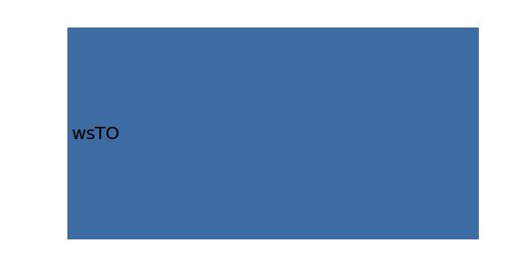

.. _aircraft.wsMAX:

Parameter: wsMAX
^^^^^^^^^^^^^^^^^^^^^^^^^^^^^^^^^^^^^^^^^^^^^^^^^^^^^^^^

    The maximum wing loading

    In aerodynamics, wing loading is the loaded weight of the aircraft divided 
    by the area of the wing. The faster an aircraft flies, the more lift is produced 
    by each unit area of wing, so a smaller wing can carry the same weight in 
    level flight, operating at a higher wing loading. Correspondingly, the landing 
    and take-off speeds will be higher. The high wing loading also decreases 
    maneuverability. The same constraints apply to birds and bats.
    
    :Unit: [kg/m2]
    :Wiki: http://en.wikipedia.org/wiki/Wing_loading 
    

Calculation Methods
"""""""""""""""""""""""""""""""""""""""""""""""""""""""
.. automethod:: VAMPzero.Component.Main.Sizing.wsMAX.wsMAX.calc

   :Dependencies: 
   * :ref:`aircraft.wsL`
   * :ref:`aircraft.wsTO`

   :Sensitivities: 

