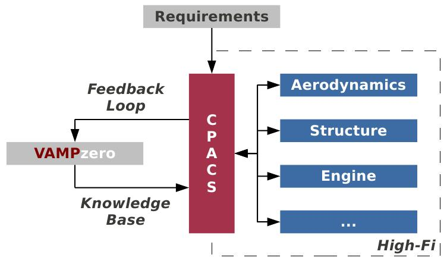

.. _cpacs:

The CPACS file
==============

.. admonition:: ... CPACS is the  

   ... Common Parametric Aircraft Configuration Schema. It is the common namespace for aircraft design within DLR. 
   For further information go to http://cpacs.dlr.de

The main result of VAMPzero is a valid CPACS file that can be found at *./ToolOutput/tooloutput.xml*. It includes a complete
geometry definition along with all mass data that VAMPzero computes. Additionally several *toolspecific*  blocks are included to 
interact with other tools from the DLR's design environment. Currently VAMPzero can produce inputs for TWDat and LIFTING_LINE.

   
In our eyes VAMPzero is supposed to be the *can-opener* for CPACS. As of now, there is no way to create CPACS files in such an easy way. 
If you want to couple your own tool with CPACS to do further analyses of the configuration you made using VAMPzero please contact: 
daniel.boehnke@dlr.de .  