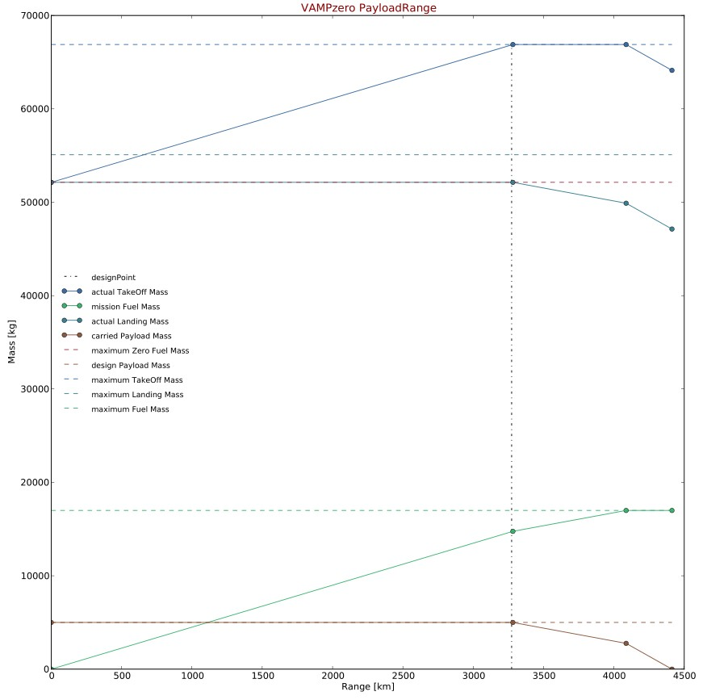

.. _payloadRange:

Payload Range Diagram
=====================

The payload range diagram displays the design weight over different missions. The design point marks the initial range the aircraft 
was designed for. The farther the distance traveled the more payload will be exchanged by additional fuel.

See :ref:`aircraft.desRange` for further information. 

:Wiki: http://en.wikipedia.org/wiki/Payload_(air_and_space_craft)