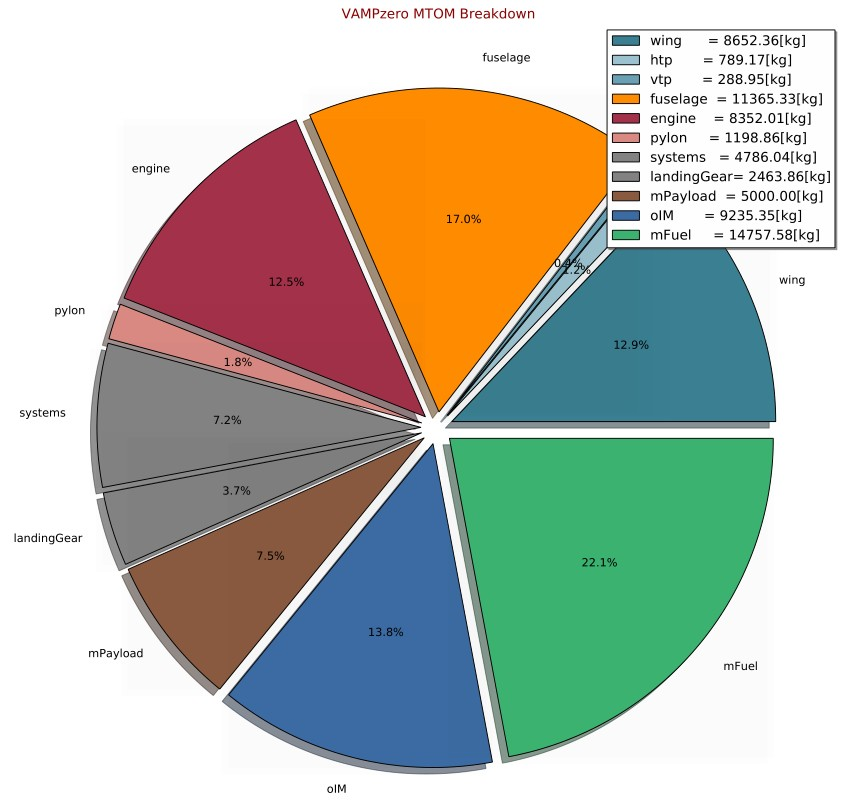

.. _mtom:

Maximum Takeoff Mass Breakdown
===============================

The maximum takeoff mass breakdown shows the distribution and absolute values of all component masses and the payload and fuel mass. 
All of these masses are displayed in more detail in their respective breakdowns. All values are in kilogram.

   
See :ref:`aircraft.mTOM` for further information.   